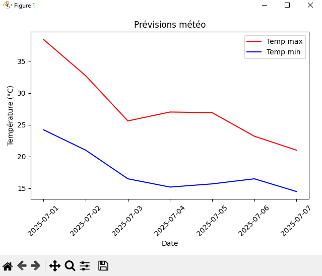
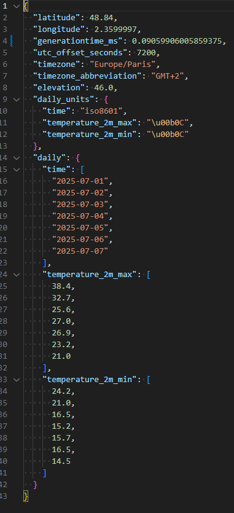

# Analyse météo avec Open-Meteo

## Description

Le but de cette application est de proposer une analyse en sur une durée d'une semaine du temps de Paris et d'écrire ces données en Json.

## Installation

Vous pouvez installer les dépendances en excutant la commande

```
pip install -r requirements.txt
```

## Test

Ce projet dispose d'un test présent dans test_main.py, exécutable via la commande

```
pytest
```

## Captures

Voici une capture d'écran de la courbe :



Et voici une capture du json en résultat:


